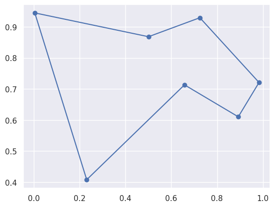

# Traveling Salesman Problem

## Description
The travelling salesman problem (TSP) asks the following question: "Given a list of cities and the distances between each pair of cities, what is the shortest possible route that visits each city exactly once and returns to the origin city?" It is an NP-hard problem in combinatorial optimization, important in theoretical computer science and operations research.

Ant Colony Optimization simulates ants, which move randomly. However, they leave pheromone, which increases chance to go through the path from one place to another. If the influence is modified, the behavior of ants can be altered: more exploitative or explorative.

Randomness is defined with the following formula:

$\large p^k_{xy} = \frac{(\tau^\alpha_{xy})(\eta^\beta_{xy})}{\sum_{z \in allowed_y}{(\tau^\alpha_{xz})(\eta^\beta_{xz})}}$

where 

$\large k^{th}$ - ant

$A_k(x)$ - possible expansion from state x 

$p^k_{xy}$ - probability of moving from state x to y

$\eta_{xy}$ - attractiveness of move based on distance

$\tau_{xy}$ - attractiveness of move based on pheromone$

Detailed information you can find on [wikipedia](https://en.wikipedia.org/wiki/Ant_colony_optimization_algorithms).



## Showcase

[sample_final1.webm](https://github.com/AndrewChmutov/aco-tsp/assets/67659210/520ac1b5-1e6b-4196-a93e-96c67093d081)

[sample_final2.webm](https://github.com/AndrewChmutov/aco-tsp/assets/67659210/43a82b3f-09be-4e4c-83b2-573d5d186bf3)

## Installation
### Ant Colony Optimization
First, you have to clone the repository:
```
git clone https://github.com/AndrewChmutov/aco-tsp
```

Then, you have to setup CMake and build it:
```
cmake -S . -B build
cmake --build build
```
### Dependencies

First things first, dependencies. Visualization is required
- Jupyter notebook (recommended)
- seaborn
- matplotlib

Installation of dependencies
```
pip install seaborn matplotlib
```

## How to use
There are two ways of usage.

### Jupyter Notebook

#### Plot graph
Run import cell, cell with function and run the following:
```
tsp(10, 0.4, 0.4, 0.5)
```

#### Tune parameters
Same approach, but run block with function and needed amount of nodes:
```
tune_tsp(10)
```

### Command line


## License

Distributed under the [MIT](https://choosealicense.com/licenses/mit/) License.
See [LICENSE](https://github.com/AndrewChmutov/aco-tsp/blob/main/LICENCE) for more information.
